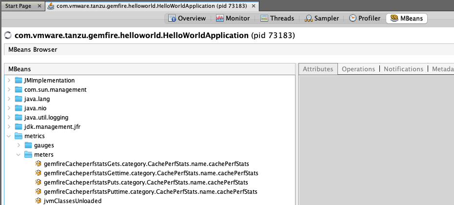

# GemFire Micrometer Bridge Starter

[](https://spring.io/projects/spring-boot)
[](https://tanzu.vmware.com/gemfire)

A Spring Boot Starter that bridges **GemFire** internal statistics into the **Micrometer** ecosystem. Surface your client-side GemFire statistic metrics directly to **Prometheus** and **JMX** with zero boilerplate.

---

## 🚀 Features

* **Regex Filtering**: Fine-grained control over which `StatisticsTypes`, `Instances`, and `Descriptors` are exported via standard properties.
* **Smart Mapping**: Automatically converts GemFire Counters to Micrometer `FunctionCounters` and Gauges to standard `Gauges`.
* **Multi-Backend Support**: Broadcasts metrics to Prometheus (pull-based) and JMX (push-based) simultaneously through the Micrometer Composite Registry.
* **Dynamic Rescanning**: Automatically detects new Regions, Pools, or CQs created after application startup.

---

## 📦 Installation

### 1. Build and Publish

In the root of the gemfire-micrometer-bridge  project, run to build the jar and publish to your .m2 repository:
```makefile
make publish
```
You can also use the Makefile to build, test, or run code coverage. See `make help` for more information.

### 2. Add Dependency to GemFire client
Add the following to your GemFire Client application's build.gradle:

```bash
dependencies {
    implementation 'com.vmware.tanzu:gemfire-micrometer-starter:1.0.0'
    
    # Micrometer registries for your desired backends
    implementation 'io.micrometer:micrometer-registry-prometheus'
    implementation 'io.micrometer:micrometer-registry-jmx'
}
```
or Pom.xml if you love Maven!
```xml
<dependencies>
    <dependency>
        <groupId>com.vmware.tanzu</groupId>
        <artifactId>gemfire-micrometer-starter</artifactId>
        <version>1.0.0</version>
    </dependency>

    <dependency>
        <groupId>io.micrometer</groupId>
        <artifactId>micrometer-registry-prometheus</artifactId>
    </dependency>
    
    <dependency>
        <groupId>io.micrometer</groupId>
        <artifactId>micrometer-registry-jmx</artifactId>
    </dependency>
</dependencies>
```
**Note:** Only include registries that you want to use to emit metrics. For example, if you don't want JMX to be enabled then don't include the `dependency micrometer-registry-jmx`.


## 🛠 Usage
### 1. Configure Metrics
Control exactly what gets exported via application.properties. 
* **Format:** 'TypeRegex' : 'StatNameRegex :: Stat1,Stat2,Stat3'
* **Default:** "CachePerfStats", "cachePerfStats::gets,getTime,puts,putTime"

```properties
# application.properties 

# example to only select gets,puts,putTime,getTime metrics for the stat type of RegionStats-Example
gemfire.metrics.bridge.export.CachePerfStats=RegionStats-Example::gets,puts,putTime,getTime

# single line example to pull all metrics for type of CachePerfStats and RegionStats-Example
gemfire.metrics.bridge.export.CachePerfStats=(RegionStats-Example|cachePerfStats)::.*

# multi-stat example to pull all stats for type of CachePerfStats, PoolStats, and ClientStats
gemfire.metrics.bridge.export.CachePerfStats=.*::.*
gemfire.metrics.bridge.export.PoolStats=.*::.*
gemfire.metrics.bridge.export.ClientStats=.*::.*

```

## Additional Properties
You can adjust the rescanning of statistics or disable the bridge entirely via the application.properties with the following properties:

```properties
# Global Toggle & Rescan Interval
gemfire.metrics.bridge.enabled=true
gemfire.metrics.rescan-interval=30000

# Micrometer Toggles
management.jmx.metrics.export.enabled=true
management.prometheus.metrics.export.enabled=true

```

## 🔍 Observability
### Prometheus 

Prometheus Metrics are available at the standard SpringBoot Actuator endpoint. Prometheus automatically treats . in the statistic name as _ for compatibility.
```bash
curl http://<your-app>/actuator/prometheus | grep -i gemfire_
```

Example Output:

```bash
# HELP gemfire_cacheperfstats_gets_total  
# TYPE gemfire_cacheperfstats_gets_total counter
gemfire_cacheperfstats_gets_total{category="CachePerfStats",name="cachePerfStats"} 3567.0

# HELP gemfire_cacheperfstats_gettime_total  
# TYPE gemfire_cacheperfstats_gettime_total counter
gemfire_cacheperfstats_gettime_total{category="CachePerfStats",name="cachePerfStats"} 2.591725656E9

# HELP gemfire_cacheperfstats_puts_total  
# TYPE gemfire_cacheperfstats_puts_total counter
gemfire_cacheperfstats_puts_total{category="CachePerfStats",name="cachePerfStats"} 7247.0

# HELP gemfire_cacheperfstats_puttime_total  
# TYPE gemfire_cacheperfstats_puttime_total counter
gemfire_cacheperfstats_puttime_total{category="CachePerfStats",name="cachePerfStats"} 4.203863011E9
```

### JMX (VisualVM)
Metrics are pushed to the MBean server under the metrics domain. Example from VisualVM: 



## 🛠 Troubleshooting
**Log Levels:** DEBUG and TRACE Logging Levels are supported and will log useful information to troubleshoot.

**Regex Debugging:** Set logging.level.com.vmware.tanzu.gemfire.starter=DEBUG to see exactly which metric Type and Names the bridge is finding during its rescan.

**Empty Map:** If your debug logs show exportConfig is {}, check the single quotes and backslashes in your application.properties file.
